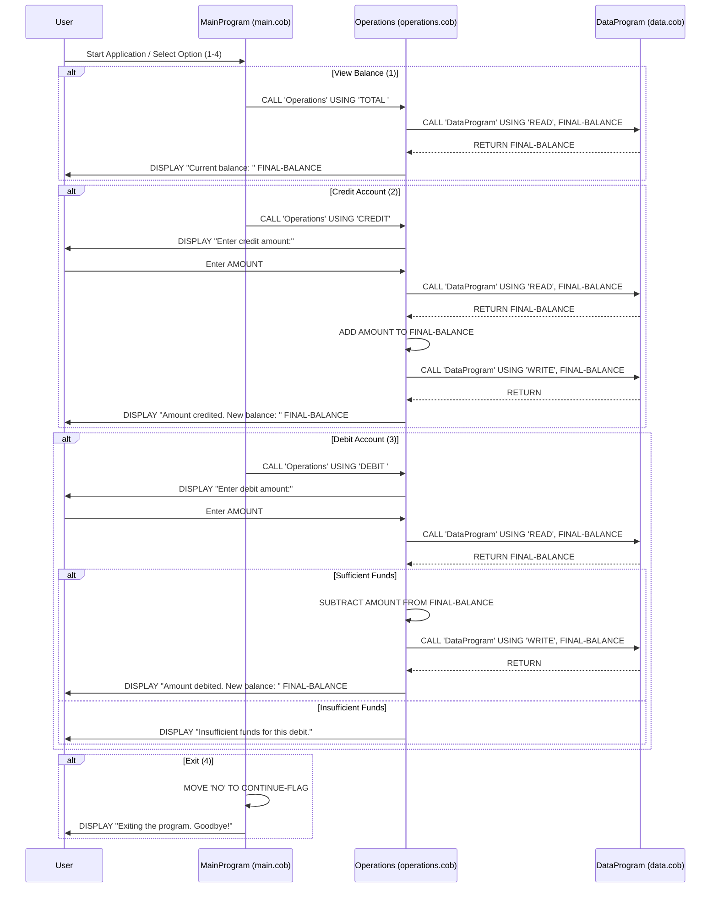

```mermaid
sequenceDiagram
    participant User
    participant MainProgram as MainProgram (main.cob)
    participant Operations as Operations (operations.cob)
    participant DataProgram as DataProgram (data.cob)

    User->>MainProgram: Start Application / Select Option (1-4)
    alt View Balance (1)
        MainProgram->>Operations: CALL 'Operations' USING 'TOTAL '
        Operations->>DataProgram: CALL 'DataProgram' USING 'READ', FINAL-BALANCE
        DataProgram-->>Operations: RETURN FINAL-BALANCE
        Operations->>User: DISPLAY "Current balance: " FINAL-BALANCE
    end

    alt Credit Account (2)
        MainProgram->>Operations: CALL 'Operations' USING 'CREDIT'
        Operations->>User: DISPLAY "Enter credit amount:"
        User->>Operations: Enter AMOUNT
        Operations->>DataProgram: CALL 'DataProgram' USING 'READ', FINAL-BALANCE
        DataProgram-->>Operations: RETURN FINAL-BALANCE
        Operations->>Operations: ADD AMOUNT TO FINAL-BALANCE
        Operations->>DataProgram: CALL 'DataProgram' USING 'WRITE', FINAL-BALANCE
        DataProgram-->>Operations: RETURN
        Operations->>User: DISPLAY "Amount credited. New balance: " FINAL-BALANCE
    end

    alt Debit Account (3)
        MainProgram->>Operations: CALL 'Operations' USING 'DEBIT '
        Operations->>User: DISPLAY "Enter debit amount:"
        User->>Operations: Enter AMOUNT
        Operations->>DataProgram: CALL 'DataProgram' USING 'READ', FINAL-BALANCE
        DataProgram-->>Operations: RETURN FINAL-BALANCE
        alt Sufficient Funds
            Operations->>Operations: SUBTRACT AMOUNT FROM FINAL-BALANCE
            Operations->>DataProgram: CALL 'DataProgram' USING 'WRITE', FINAL-BALANCE
            DataProgram-->>Operations: RETURN
            Operations->>User: DISPLAY "Amount debited. New balance: " FINAL-BALANCE
        else Insufficient Funds
            Operations->>User: DISPLAY "Insufficient funds for this debit."
        end
    end

    alt Exit (4)
        MainProgram->>MainProgram: MOVE 'NO' TO CONTINUE-FLAG
        MainProgram->>User: DISPLAY "Exiting the program. Goodbye!"
    end
```