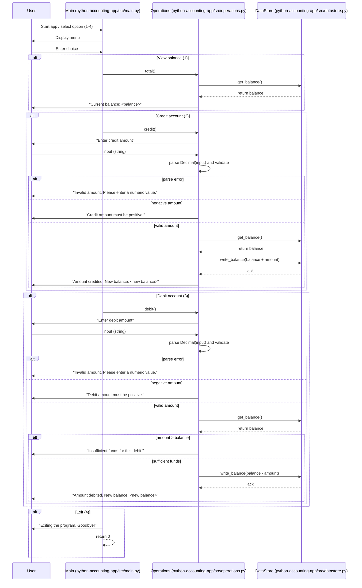

```mermaid
sequenceDiagram
    participant User
    participant Main as Main (python-accounting-app/src/main.py)
    participant Ops as Operations (python-accounting-app/src/operations.py)
    participant Store as DataStore (python-accounting-app/src/datastore.py)

    User->>Main: Start app / select option (1-4)
    Main->>User: Display menu
    User->>Main: Enter choice

    alt View balance (1)
        Main->>Ops: total()
        Ops->>Store: get_balance()
        Store-->>Ops: return balance
        Ops->>User: "Current balance: <balance>"
    end

    alt Credit account (2)
        Main->>Ops: credit()
        Ops->>User: "Enter credit amount"
        User->>Ops: input (string)
        Ops->>Ops: parse Decimal(input) and validate
        alt parse error
            Ops->>User: "Invalid amount. Please enter a numeric value."
        else negative amount
            Ops->>User: "Credit amount must be positive."
        else valid amount
            Ops->>Store: get_balance()
            Store-->>Ops: return balance
            Ops->>Store: write_balance(balance + amount)
            Store-->>Ops: ack
            Ops->>User: "Amount credited. New balance: <new balance>"
        end
    end

    alt Debit account (3)
        Main->>Ops: debit()
        Ops->>User: "Enter debit amount"
        User->>Ops: input (string)
        Ops->>Ops: parse Decimal(input) and validate
        alt parse error
            Ops->>User: "Invalid amount. Please enter a numeric value."
        else negative amount
            Ops->>User: "Debit amount must be positive."
        else valid amount
            Ops->>Store: get_balance()
            Store-->>Ops: return balance
            alt amount > balance
                Ops->>User: "Insufficient funds for this debit."
            else sufficient funds
                Ops->>Store: write_balance(balance - amount)
                Store-->>Ops: ack
                Ops->>User: "Amount debited. New balance: <new balance>"
            end
        end
    end

    alt Exit (4)
        Main->>User: "Exiting the program. Goodbye!"
        Main-->>Main: return 0
    end
```